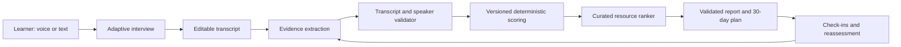

# AI Path Advisor Architecture

## Design principle

Voice is an input surface, not the assessment authority. The system separates conversational adaptation from evidence validation, scoring, resource selection, and report generation so each result can be reproduced and audited.

## System boundaries

The current private-alpha slice implements the page shell, a complete text interaction, a deterministic five-to-seven-question evidence interview, reviewed-input contracts, conservative server-owned evidence extraction, deterministic scoring and governed catalog recommendations, an evidence-and-constraint-aware plan composer, mock-safe route handlers, dormant owner-scoped persistence, and a fail-closed OpenAI Realtime boundary.

## Runtime components

### Browser

- Server-rendered page metadata and static shell.
- A narrowly scoped Client Component owns the multistep interaction and browser microphone API.
- Typed mode provides the same assessment controls as voice mode.
- The interview chooses application-owned follow-ups from missing evidence dimensions; learner text is treated as bounded data and never becomes an instruction or generated question.
- The 30-day plan is recomposed from assessed growth areas, weekly time, coding comfort, role category, blocker category, and governed resource identifiers. Raw free-form profile text is never interpolated into plan instructions.
- The browser never receives the OpenAI API key or server-only safety configuration.

### Application API

- `POST /api/ai-path/session` validates consent and creates an assessment-session envelope. It is mock/non-persistent until authenticated storage is introduced.
- `POST /api/ai-path/analysis` validates transcript-linked evidence, applies versioned rules, and returns a deterministic report.
- `POST /api/ai-path/realtime/session` reports mock capability by default. Live traffic must fail closed until a caller is authenticated and owns a persisted assessment session.

### Assessment domain

- Taxonomy, catalog, consent, scoring, and report versions are immutable identifiers on every generated report.
- Evidence must quote exact user speech or text and reference one or more known user turn IDs.
- “Not assessed” is a first-class result, distinct from a beginner level.
- Aspirations and topic mentions do not count as competence; stronger levels require learner-owned action, an inspectable artifact, or an observable outcome.
- Recommendation order is deterministic, constrained by prerequisites, time, format, price preference, and an application-owned catalog.

### Dormant durable persistence foundation

Implemented migration contracts, not yet applied to a live database:

- `users`: authenticated account and deletion state;
- `assessment_sessions`: owner, mode, consent version, status, timestamps, retention policy;
- `transcript_turns`: speaker, text, sequence, user-edited marker, source, retention expiry;
- `evidence_records`: transcript spans, taxonomy version, extraction provenance, learner review state;
- `assessment_reports`: scoring/report/catalog versions and immutable result snapshot;
- `plans`: selected project, weekly actions, time budget, status;
- `check_ins`: completed actions, new artifacts, learner reflection;
- `catalog_resources`: reviewed metadata, canonical URL, availability check, skill mappings.

The current migrations cover assessment sessions/reports and the plan loop. Direct table writes are revoked; owner mutations use bounded RPCs, while report generation, plan generation, adaptation proposals, reassessment snapshots, and purge operations remain service-only. Production latches remain closed until a disposable Supabase environment proves RLS and RPC behavior with separate users, concurrency, deletion cascades, and scheduled retention.

Assessment-session and learning-plan routes both have request-runtime selectors. The learning-plan selector is wired to its future Supabase adapter but remains unreachable behind two independent literal-false plan latches plus the closed assessment-session persistence latch. Its factory verifies every capability before authentication, service-credential access, or client construction; it uses separate authenticated-user and service-role clients and fails to a generic disabled runtime without an in-memory fallback. No environment variable can open any code latch.

Raw audio is not an entity in the default architecture.

## Realtime integration gate

The intended browser path follows the official OpenAI WebRTC architecture: the browser creates an offer; the application server uses its server-held credential to establish the Realtime call; the answer is returned to the browser. The server configures interview instructions and allowed behavior. Application tools remain server-owned.

Live mode requires all of the following:

1. explicit approval for paid API usage and a documented monthly ceiling;
2. server-only API credential and a non-identifying safety-identifier salt;
3. deployment flags enabling both Realtime and paid calls;
4. authenticated user identity;
5. persisted assessment session owned by that user;
6. per-user and global rate limits, concurrency caps, and a kill switch;
7. retention, export, and deletion paths tested end to end;
8. latency, error, and cost telemetry without raw transcript leakage.

Until those conditions exist, the route returns text fallback capability and performs no OpenAI network call.

## Analysis pipeline

The production pipeline should be two-phase:

1. A model produces candidate evidence objects from the reviewed transcript using a strict schema. It cannot score or recommend.
2. The application validates each quote against exact user turns, rejects unsupported claims, applies deterministic rules, selects catalog resources, and validates the final report contract.

The current route accepts candidate evidence directly to exercise phase two without requiring a paid model call. Fixture transcripts should cover beginners, experts, contradictory claims, sparse answers, prompt injection, long answers, non-native English, and requests to delete or correct evidence.

## Security and privacy invariants

- Import server-only modules at the server boundary.
- Reject live calls for anonymous, missing, expired, or non-owned sessions.
- Do not trust client-supplied evidence, transcript speakers, taxonomy versions, prices, or resource URLs.
- Bound request sizes and array counts before expensive work.
- Sanitize logged errors; never log audio, full transcripts, SDP, credentials, or generated ephemeral secrets.
- Treat transcript content as untrusted data, not system instructions.
- Use opaque IDs, CSRF-safe authenticated endpoints, and short retention defaults.

## Observability

Track funnel events without transcript contents: landing, profile complete, mode selected, session started, session completed, review edits, report generated, plan saved, first task completed, and reassessment. Operational telemetry should include Realtime setup success, disconnects, latency percentiles, cost per completed assessment, validation rejection reasons, and deletion completion time.
